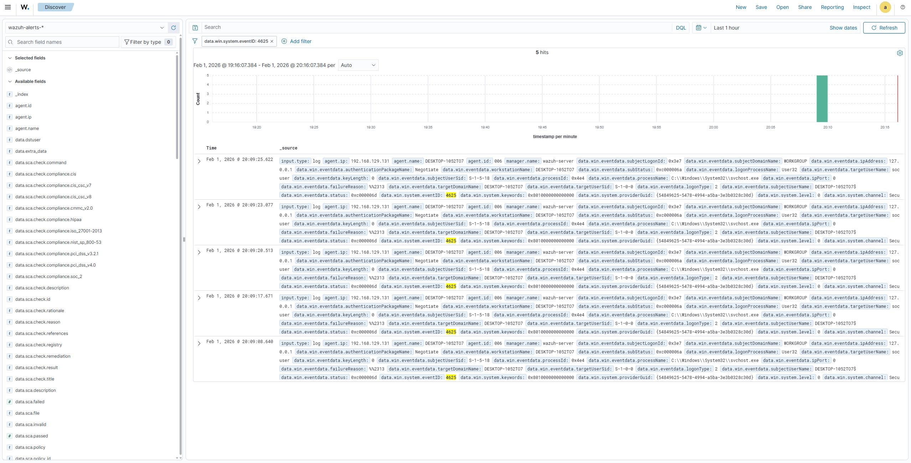
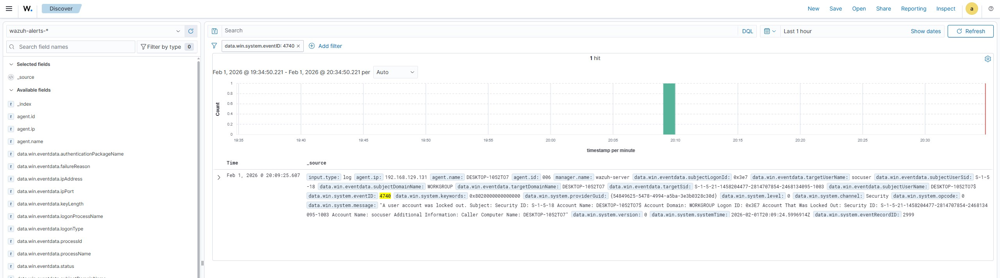

# Project 02 – Windows Authentication Attack Detection & SOC Alert Triage

## Objective

To simulate and investigate a brute force authentication attack using Windows Security Event logs within Wazuh SIEM.

---

## Scenario Overview

Multiple failed authentication attempts were generated against a local Windows account to simulate brute force behaviour.

The objective was to validate detection capability and assess whether the observed activity indicated malicious intent.

---

## Windows Event IDs Analysed

- 4625 – Failed logon attempts  
- 4740 – Account lockout  
- 4624 – Successful logon (verification)

---

## Investigation Approach

1. Identified repeated 4625 failed logon events.
2. Correlated timestamps to evaluate attack velocity.
3. Confirmed 4740 account lockout event.
4. Checked for any successful 4624 logon following the failures.
5. Assessed risk of credential compromise.

---

## Outcome

---

## Supporting Evidence

### Failed Logon Attempts (Event ID 4625)

### Account Lockout (Event ID 4740)

### Successful Logon After Failed Attempts (Event ID 4624)

### Source of Brute Force Attempt

---

The activity was classified as a simulated brute force attempt resulting in account lockout, with no successful authentication observed.
