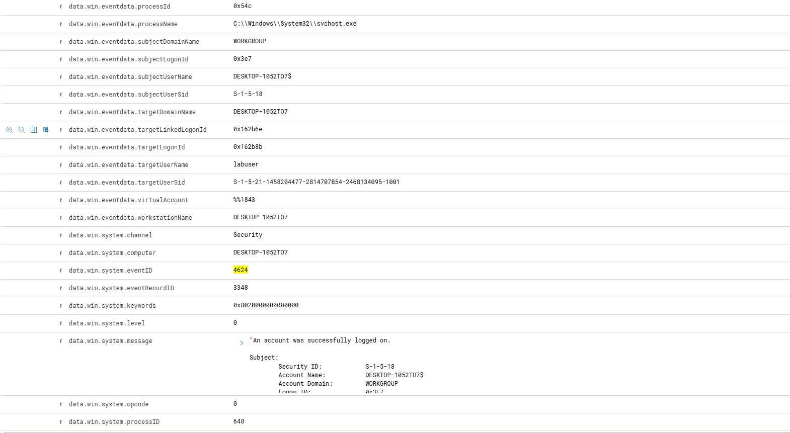
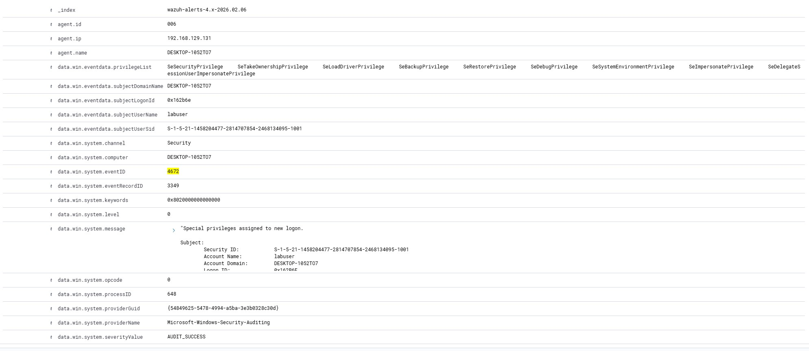
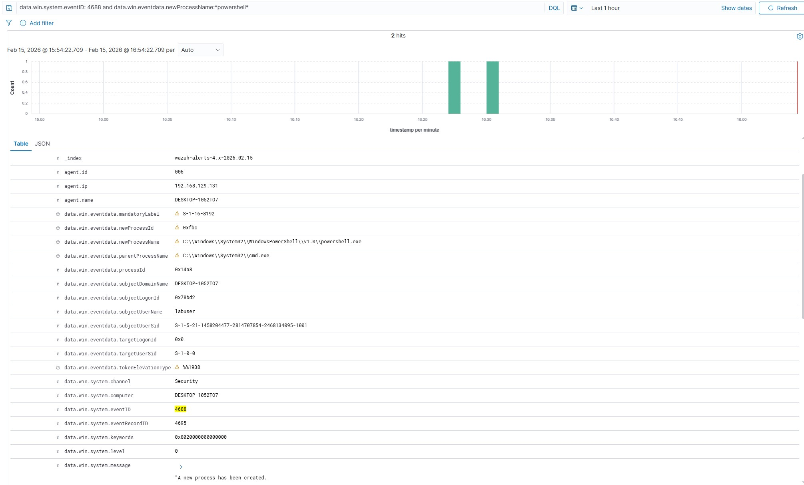
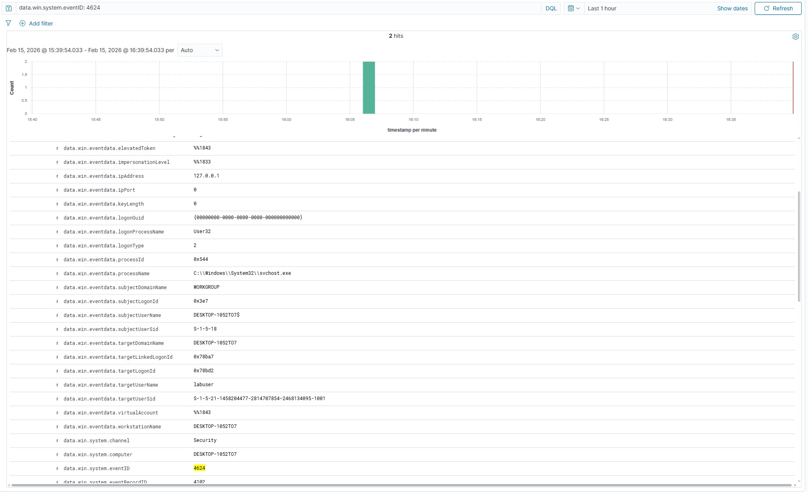
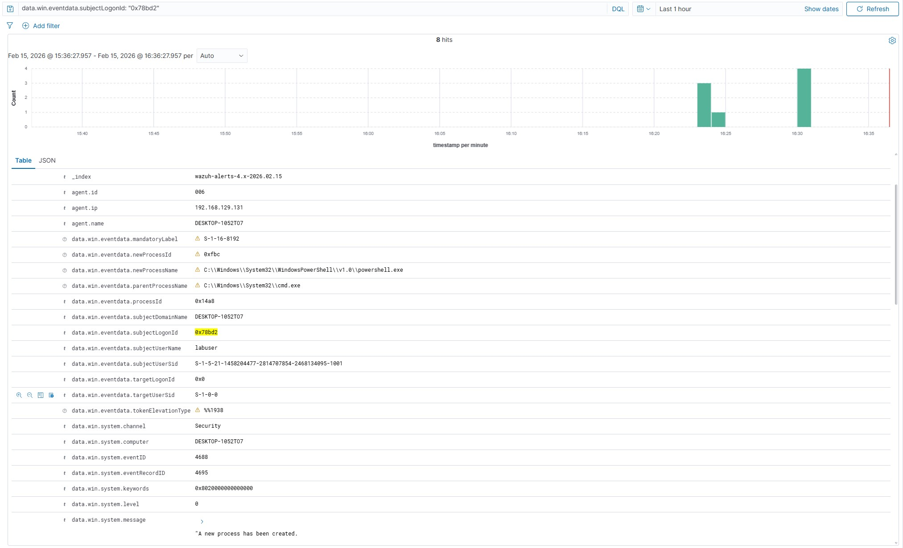

# Project 03 – Windows Logon and Process Correlation Investigation

## Objective

To correlate Windows logon events with process creation events using Logon ID tracking in order to reconstruct user activity and validate session behaviour within a monitored endpoint.

---

## Scenario Overview

This investigation focused on analysing the relationship between successful logon events (4624) and subsequent process creation events (4688).

The goal was to determine whether processes executed under a specific logon session were legitimate or potentially suspicious.

---

## Event Correlation Approach

The following Windows Security Event IDs were analysed:

- 4624 – Successful logon
- 4688 – Process creation
- 4672 – Special privileges assigned

Correlation was performed using:

- Logon ID field comparison
- Timestamp alignment
- User account validation
- Process command-line inspection

---

## Investigation Steps

1. Identified a successful 4624 logon event.
2. Extracted the associated Logon ID.
3. Filtered 4688 process creation events using the same Logon ID.
4. Analysed executed processes and command-line arguments.
5. Verified whether elevated privileges (4672) were assigned during the session.

---

## Findings

Process activity was successfully correlated to the specific logon session.

No anomalous or unauthorised command execution was identified during the investigation window.

---

## Outcome

This project demonstrated the ability to reconstruct user session activity through event correlation, a critical capability for Tier 1 SOC investigations involving suspicious account activity or potential privilege abuse.

## Supporting Evidence

### Successful Logon (Event ID 4624)

---

### Special Privileges Assigned (Event ID 4672)

---

### Process Creation – PowerShell Execution (Event ID 4688)

---

### Logon ID Correlation – 4624

---

### Logon ID Correlation – 4688

