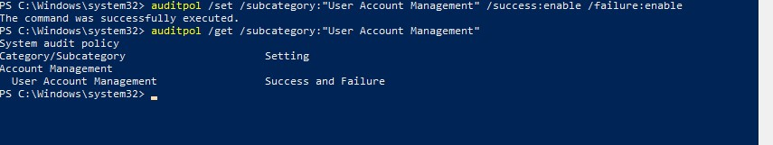
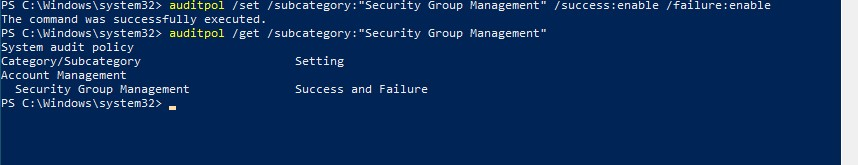
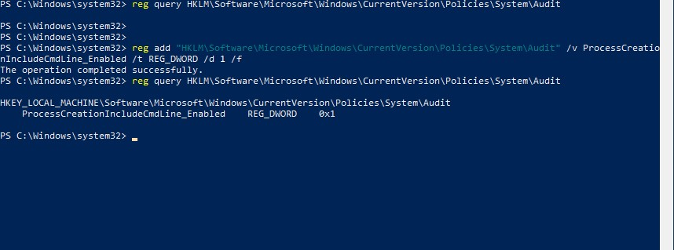
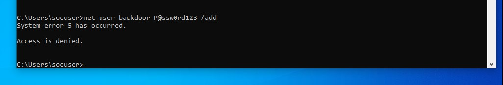
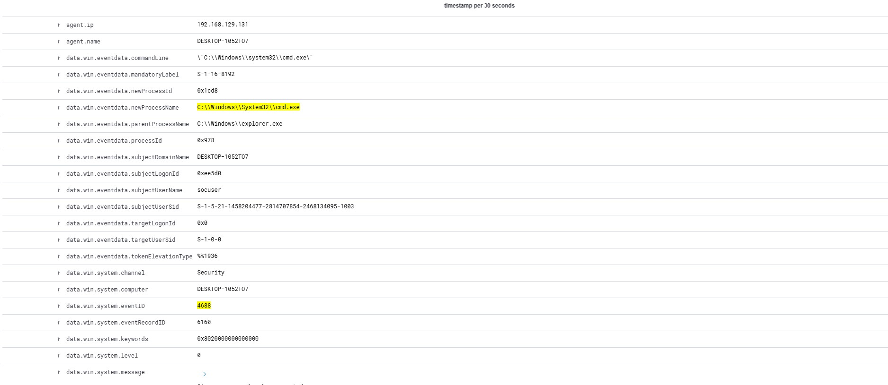
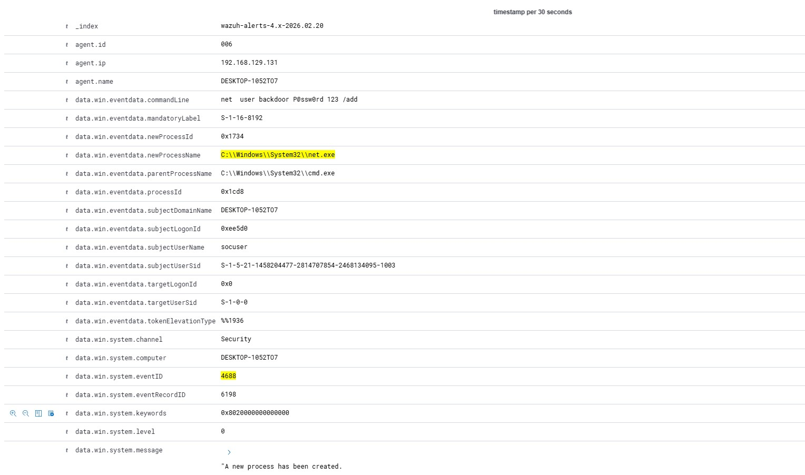
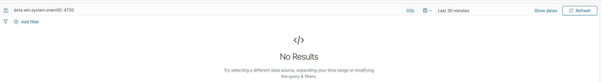

# Project 04 – Privilege Escalation and Suspicious Account Creation Investigation

## Objective

To investigate a simulated suspicious account creation attempt and assess potential privilege escalation activity using Windows Security Event logs within Wazuh SIEM.

---

## Scenario Overview

A command was executed to simulate local user account creation in order to analyse detection capability and evaluate whether the activity could represent unauthorised privilege escalation.

The investigation focused on identifying:

- Account creation events
- Elevated privilege assignment
- Associated logon session activity
- Command execution context

---

## Relevant Windows Event IDs

- 4720 – User account created
- 4672 – Special privileges assigned
- 4688 – Process creation
- 4624 – Successful logon

---

## Investigation Approach

1. Identified the 4720 event indicating account creation.
2. Correlated the event to a specific logon session using Logon ID.
3. Analysed 4688 process creation logs to determine which command initiated the action.
4. Reviewed 4672 events to verify if elevated privileges were assigned.
5. Evaluated whether the behaviour aligned with authorised administrative activity.

---

## Findings

The account creation event was successfully detected and correlated with its originating process.

No unauthorised privilege escalation was confirmed, as the activity was generated within a controlled lab environment for testing purposes.

---

## Outcome

This project demonstrated the ability to detect and investigate potential privilege escalation scenarios, correlate user activity, and assess the security impact of account creation events within a SOC workflow.

## Supporting Evidence

### Audit Policy – User Account Management Enabled

---

### Audit Policy – Security Group Management Enabled

---

### Process Creation Command-Line Logging Enabled

---

### Failed User Creation Attempt (Access Denied)

---

### Process Creation – cmd.exe Execution (Event ID 4688)

---

### Process Creation – net user Attempt (Event ID 4688)

---

### No Event ID 4720 – User Not Created

