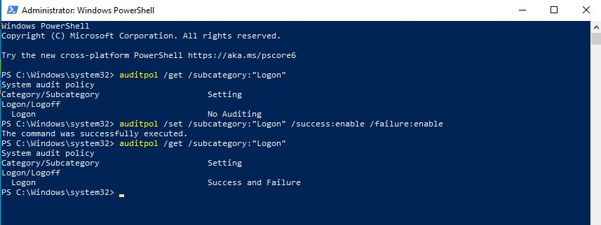
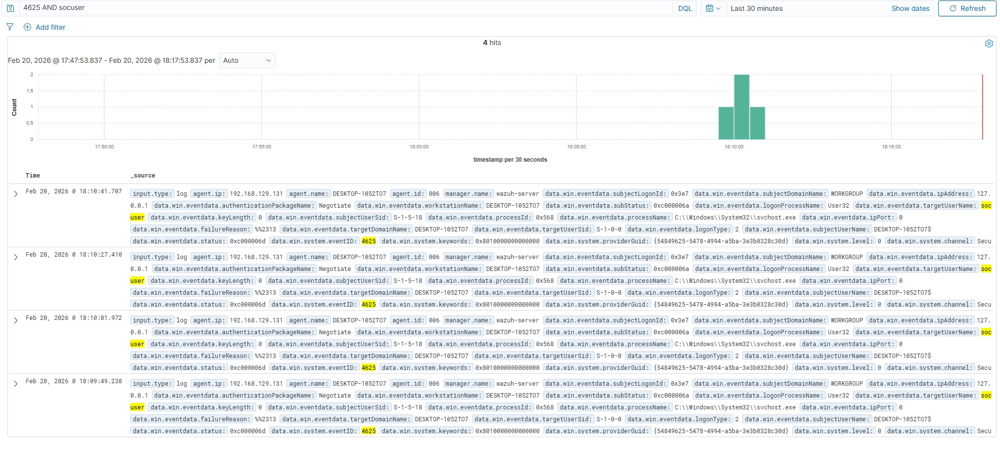
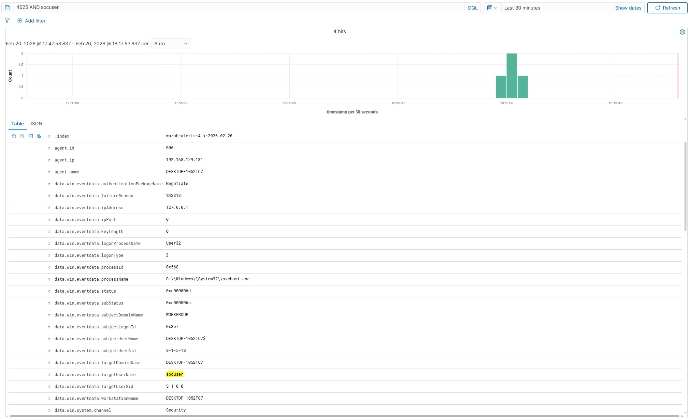

# Project 05 – Brute Force Detection and Authentication Log Analysis

## Objective

To analyse authentication log patterns in order to identify brute force attack indicators and validate detection accuracy within Wazuh SIEM.

---

## Scenario Overview

This investigation focused on analysing repeated authentication failures and evaluating behavioural patterns consistent with brute force activity.

The aim was to distinguish between:

- User error (incorrect password attempts)
- Automated brute force behaviour
- Service account misconfiguration

---

## Windows Event IDs Analysed

- 4625 – Failed logon
- 4624 – Successful logon
- 4740 – Account lockout

---

## Analytical Approach

The investigation included:

- Counting failed login attempts within defined time intervals
- Identifying velocity and frequency patterns
- Reviewing failure reason codes (e.g., bad password)
- Verifying presence or absence of successful logon events
- Assessing source IP consistency

---

## Behavioural Indicators Reviewed

- Multiple failed attempts within seconds
- Sequential authentication failures against a single account
- Lockout triggered after threshold exceeded
- Absence of legitimate successful authentication

---

## Findings

The analysed activity matched brute force behavioural characteristics within a controlled lab scenario.

No successful credential compromise was identified.

---

## Outcome

This project demonstrated the ability to differentiate between benign authentication errors and malicious brute force behaviour, reinforcing core Tier 1 SOC analytical skills in log interpretation and attack pattern recognition.

## Supporting Evidence

### Logon Audit Policy Enabled

---

### Multiple Failed Logon Attempts (Event ID 4625)

---

### Failed Logon Event Details (4625)

